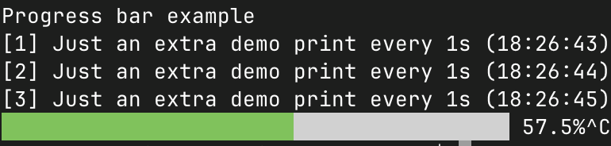

# progressbar
[](https://goreportcard.com/report/fortio.org/progressbar)
[](https://pkg.go.dev/fortio.org/progressbar)
[](https://github.com/fortio/progressbar/actions/workflows/include.yml)
[](https://github.com/fortio/progressbar/releases/)


Zero dependency cross platform (just needs basic ANSI codes and Unicode font support) golang concurrent safe progress bar for terminal/CLIs, with 8x the resolution of others (8 steps per character).


## Examples

### Manually updating a progress bar and additional output

Manually handling a 2 lines output updates (1 misc line and the 1 line for the progress bar)
```go
	pb := progressbar.Config{Width: 60, UseColors: true}
	fmt.Print("Progress bar example\n\n") // 1 empty line before the progress bar, for the demo
	n := 1000
	for i := 0; i <= n; i++ {
		pb.ProgressBar(100. * float64(i) / float64(n))
		if i%63 == 0 {
			progressbar.MoveCursorUp(1)
			fmt.Printf("Just an extra demo print for %d\n", i)
		}
		time.Sleep(20 * time.Millisecond)
	}
```

### Concurrent safe screen writer example

```go
	pb := progressbar.Config{Width: 60, UseColors: true}
	w := progressbar.ScreenWriter(os.Stdout)
	fmt.Fprintln(w, "Progress bar example")
	// demonstrate concurrency safety:
	go PrintStuff(w, *everyFlag)
	// exact number of 'pixels', just to demo every smooth step:
	n := pb.Width * 8
	for i := 0; i <= n; i++ {
		pb.ProgressBar(100. * float64(i) / float64(n))
		time.Sleep(*delayFlag)
	}
```

```sh
go run fortio.org/progressbar/example@latest -color
```

Produces



Or without color:
```
◅███████████████████████████▊            ▻ 69.4%
```

### Automatic Reader or Writer progress bar

```go
	reader := progressbar.NewAutoReader(resp.Body, resp.ContentLength)
	_, err = io.Copy(os.Stdout, reader)
	reader.Close()
```

See it in action with a progress bar while downloading a URL:
```sh
go run fortio.org/progressbar/auto_example@latest https://go.dev/ > go_dev.html
```

Will show a progress bar for instance
```
$  go run ./auto_example https://go.dev/dl/go1.24.1.src.tar.gz > /dev/null
Fetching https://go.dev/dl/go1.24.1.src.tar.gz
⣾ █████████████████████▌                   53.7% 15.766 Mb out of 29.352 Mb, 293ms elapsed, 53.790 Mb/s, 253ms remaining
```

### Multicurl
You can see it in use in [fortio/multicurl](https://github.com/fortio/multicurl?tab=readme-ov-file#multicurl) cli too.

## See also

If you have more advanced needs for TUI including raw mode input or readline, you can also see/use/have a look at

[github.com/fortio/terminal](https://github.com/fortio/terminal#terminal)

And still use this for a progress bar part.
